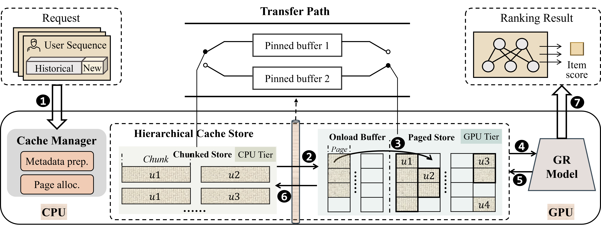

# MTServe: Efficient Serving for Generative Recommendation Models with Hierarchical Caches

## Overview

MTServe is a hierarchical cache management system for efficient serving of generative recommendation (GR) models. 

Generative recommendation offers superior modeling capabilities but suffers from prohibitive inference costs due to the repeated encoding of long user histories. While cross-request Key-Value (KV) cache reuse presents a significant optimization opportunity, the massive scale of individual user states creates a storage explosion that far exceeds physical GPU limits. MTServe virtualizes GPU memory by leveraging host RAM as a scalable backup store, and introduces a suite of system-level optimizations to bridge the I/O gap between tiers:

- **Hybrid storage layout** — organizes KV cache across GPU and host memory tiers for efficient access patterns
- **Asynchronous data transfer pipeline** — overlaps host-to-device KV data transfer with HSTU computation to hide I/O latency
- **Locality-driven replacement policy** — optimizes cache eviction decisions based on access locality

<p align="center">
  
</p>
<p align="center"><em>MTServe Overall Framework</em></p>

This project is developed based on [NVIDIA RecSys Examples](https://github.com/NVIDIA/recsys-examples), extending the HSTU inference infrastructure with hierarchical cache management for production-grade GR serving.

## Project Structure

```
mtserve/
├── commons/          # Shared data processing, datasets, and utilities
├── hstu/             # HSTU model: inference, modules, and ops
│   ├── inference/    # Inference with paged KV cache, CUDA graph, Triton Server
│   ├── model/        # Model definitions
│   ├── modules/      # HSTU modules (metrics, embeddings, etc.)
│   ├── ops/          # Custom CUDA operators
│   └── utils/        # Configuration and utility functions
├── corelib/          # Core libraries
│   ├── hstu/         # HSTU attention kernels (CUTLASS/CuteDSL)
│   └── dynamicemb/   # Dynamic embedding tables with eviction and admission control
├── docker/           # Dockerfiles for environment setup
│   ├── Dockerfile           # Standard inference image
│   ├── Dockerfile.nve       # Triton Server + NVEmbedding image
│   └── Dockerfile.pyt_build # PyTorch build image
└── figs/             # Figures and diagrams
```

## Inference

### Architecture

MTServe builds upon the HSTU inference stack with a hierarchical cache management system. The inference pipeline consists of:

1. **AsyncKVCacheManager** — Manages KV data across GPU memory (primary) and host RAM (backup). The GPU KV cache is organized as a paged table supporting append, lookup, and eviction (LRU policy). The host KV storage serves as a scalable backup, with all onload/offload operations implemented asynchronously to hide I/O overhead.

2. **Asynchronous H2D Transfer** — Host-to-device KV data transfer is performed on a side CUDA stream, overlapped layer-wise with HSTU computation, effectively hiding the data transfer latency.

3. **Kernel Fusion** — Fused HSTU block operations (LayerNorm, dropout, etc.) for reduced memory bandwidth and kernel launch overhead.

### Quick Start

#### Environment Setup

Build the Docker image (with inference support only):

```bash
docker build \
    --platform linux/amd64 \
    --build-arg INFERENCEBUILD=1 \
    -t mtserve:inference \
    -f docker/Dockerfile .
```

#### Data Preprocessing

```bash
export PYTHONPATH=${PYTHONPATH}:$(realpath ../)

# Download and preprocess the KuaiRand-1K dataset
python3 ./commons/hstu_data_preprocessor.py --dataset_name "kuairand-1k" --inference
```

#### Run Inference

Two inference modes are supported:

- **`simulate`** — Simulates serving with hierarchical KV cache, processing user sequences incrementally and measuring end-to-end throughput.

```bash
# Simulate mode with hierarchical KV cache
python3 ./hstu/inference/inference_gr_ranking.py \
    --gin_config_file ./hstu/inference/configs/kuairand_1k_inference_ranking.gin \
    --checkpoint_dir ./ \
    --mode simulate \
    --max_bs 8 \
    --gpu 0
```

Key arguments:

| Argument | Description |
|----------|-------------|
| `--mode` | `simulate` |
| `--max_bs` | Max batch size (simulate mode) |
| `--gpu` | GPU device id |
| `--disable_kvcache` | Disable KV cache for baseline comparison |
| `--disable_context` | Disable contextual features |
| `--disable_auc` | Skip AUC computation (simulate mode) |

### KVCache Manager API

| Operation | Description |
|-----------|-------------|
| `prepare_kvcache_async` | Allocate KV cache pages, compute metadata, and trigger async host→GPU onload |
| `prepare_kvcache_wait` | Wait for page allocation and metadata computation to complete |
| `offload_kvcache` | Async offload KV data from GPU cache to host storage |
| `evict_kv_cache` | Evict all KV data from the cache manager |

## Acknowledgements

This project is developed based on [NVIDIA RecSys Examples](https://github.com/NVIDIA/recsys-examples).


